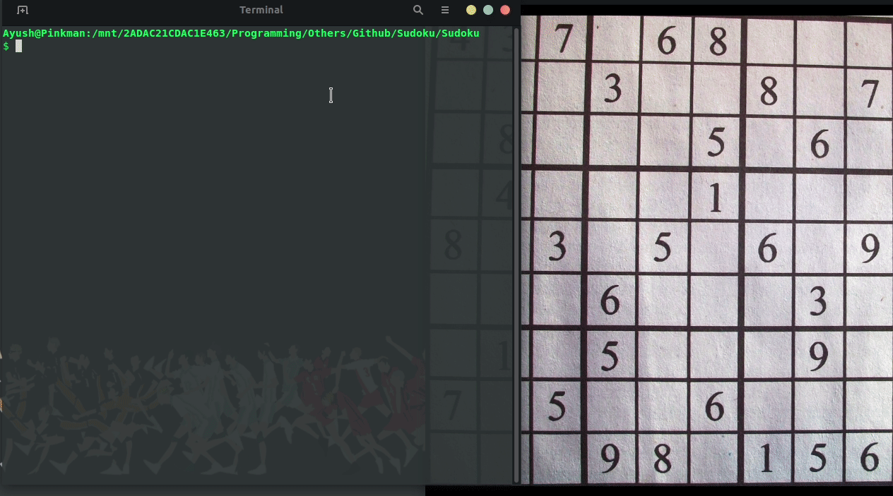

# Sudoku Scanner And Solver

## Introduction
This is a Sudoku Puzzle Solver application which is built in Qt Framework, PyGame using Python language. It provides an option to either identify the puzzle input by **scanning a well cropped puzzle image** or by **entering the values manually**. After automatic recognition of values, the program asks the user to verify the detected numbers and then continue with the solution.

## Contents
- [Demo](https://github.com/DiAnant/Sudoku_Scanner_And_Solver/#Demo)
- [Installation](https://github.com/DiAnant/Sudoku_Scanner_And_Solver/#Installation)
- [Usage](https://github.com/DiAnant/Sudoku_Scanner_And_Solver/#Usage)
- [Working](https://github.com/DiAnant/Sudoku_Scanner_And_Solver/#Working)
- [Scope For Improvement](https://github.com/DiAnant/Sudoku_Scanner_And_Solver/#Scope-For-Improvement)

## Demo

## Installation
* Install 3.8 from [here](https://www.python.org/downloads/release/python-382/)
* Install git from [here](https://git-scm.com/downloads)
* Run `git clone https://github.com/DiAnant/Sudoku_Scanner_And_Solver.git`
* Run `pip install -r requirements.txt`

## Usage
* Execute `main.py`
* Upload an image or input the values manually.
* Press `enter` to solve the board.
* Press 'space' to reset the board.
* Click the particular square in the sudoku grid and press a number key to change its value to that number.

## Working
* The app interface is built on PyQt5 (Qt) Framework and the grid puzzle is built using PyGame. 
* Tensorflow is used for detection of numbers from the input image. Weights trained on a Deep CNN on MNIST database with very high test accuracies are already prepared.
* A standard backtracking procedure is used to solve the puzzle once the detected numbers are confirmed by the user.

## Scope For Improvement
* The current application requires the input image to be perfectly well cropped. An incorrectly cropped or straightened image will result in mis-detection of the numbers.
* A much faster Numpy based **Inference** algorithm can be developed instead of using tensorflow for detection purpose.
* Instead of using a standard backtracking algorithm, a faster sudoku solving algorithm developed by Peter Norvig can be used.